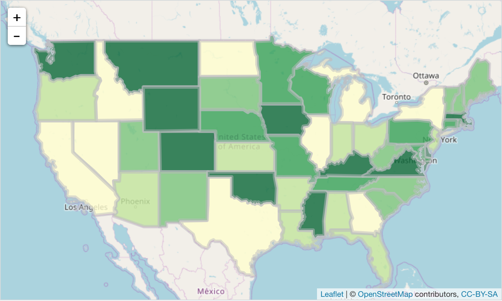

```{r setup, include=FALSE}
knitr::opts_chunk$set(echo = FALSE)

# Loading packages we will be using
library(shiny)
library(dplyr)
library(ggplot2)
library(tidyr)
library(stringr)
library(leaflet)


# Loading in data
collegedata <- read.csv("MungingProjectsDataofInterest.csv")

# Turning the state column into a factor
collegedata$STABBR <- factor(collegedata$STABBR)

# Renaming columns
independent_variables <- c("Percentage of First-Time College Students", 
                           "Household Income of Dependent Students", 
                           "Income of Independent Students", 
                           "Median Student Debt at Graduation",
                           "Percentage of Students that are Dependents"
                           )

colnames(collegedata)[9:13] <- independent_variables

# 
collegedata$Year <- as.Date(as.character(collegedata$Year), format="%Y")
```

## Recession and loans 

According to the Federal Reserve Bank of New York, student loan debt has grown more than auto loan, credit card, and home equity loan debt combined since 2003. 

The goal of this project is to take a look at descriptive statistics to see how things have changed for students since the 2008 economic crisis.

## Cleaning the data

```{r, eval = FALSE}
i <- 96
for (dat in myfiles) {
  cat('\n', i, '\n')
  i <- i + 1
  all_cols <- colnames(dat)
  
  for (col in all_cols) {
    perc_na <- sum(dat[,col] %in% c('NULL', 'PrivacySuppressed')) / nrow(dat)
    if (per_na != 1.0) {
      cat(col, perc_na, '\n')
    }
  }
}
```


## Interactive plots

```{r metrics}
# Shiny app
sidebarPanel(
  selectizeInput("states",
                 "State",
                 levels(collegedata$STABBR),
                 selected = "FL",
                 multiple = FALSE), 
  checkboxGroupInput("variables",
                     "Variables to Plot:",
                     choices = independent_variables,
                     selected = independent_variables[2],
                     width = "50em"))
mainPanel(
  renderPlot(
      collegedata[collegedata$STABBR %in% input$states,] %>%
        group_by(Year) %>% 
        select(input$variables) %>%
        mutate_all(median) %>%
        gather(variable, value, -Year) %>%
        ggplot() + 
          labs(y=NULL, x="Year", color="Variable") + 
          theme_bw() + 
          theme(legend.position = "top") +
          scale_color_discrete(labels = function(x){str_wrap(x, width = 20)}) + 
          scale_y_continuous(labels = scales::comma) + 
          scale_x_date(date_breaks = "2 year", minor_breaks=NULL, date_labels="%Y") + 
          geom_line(aes(x=Year, y=value, color=variable))
))
```

## Where does your tuition go?

```{r tuition, echo = FALSE, message =FALSE}
tuition <- collegedata %>% group_by(Year) %>% select(c(TUITFTE, INEXPFTE, AVGFACSAL, PFTFAC)) %>% summarize_all(median)

ggplot(collegedata) + geom_smooth(aes(x = Year, y = TUITFTE, color = "Average Tuition Revenue per Student", fill= "Average Tuition Revenue per Student")) + geom_smooth(aes(x = Year, y = INEXPFTE, color = "Average Instructional Expenditure per Student", fill = "Average Instructional Expenditure per Student")) +
  theme_bw() + 
  labs(y=NULL, x="Year", fill="Variable", color="Variable") + 
  guides(color=FALSE) + 
          theme(legend.position = "top") +
          scale_y_continuous(labels = scales::dollar) + 
          scale_x_date(date_breaks = "2 year", minor_breaks = NULL, date_labels = "%Y")
```

## How much of it goes to faculty?

```{r faculty, echo = FALSE, message =FALSE}
ggplot(collegedata) + geom_smooth(aes(x=Year, y=PFTFAC)) + theme_bw() + scale_y_continuous(labels = scales::percent) + labs(y="% of Faculty Employed Full-Time")
```

## Choropleth of Full Time Staff

```{r map}
state_data <- collegedata %>%
    group_by(STABBR) %>%
    select(PFTFAC, STABBR) %>%
    summarize(mean(as.numeric(PFTFAC), na.rm=TRUE))

colnames(state_data) <- c('NAME', 'MEAN')

state_data$NAME <- state.name[match(state_data$NAME,state.abb)]

states <- geojsonio::geojson_read("us-states.geojson", what = "sp")

all_data <- merge(states, state_data, by = "NAME")

m <- leaflet(states) %>%
  setView(-96, 37.8, 4) %>%
  addTiles()

pal <- colorQuantile("YlGn", NULL, n = 5)

m %>% addPolygons(fillColor = ~pal(all_data$MEAN), 
              fillOpacity = 0.8, 
              color = "#BDBDC3")
```




